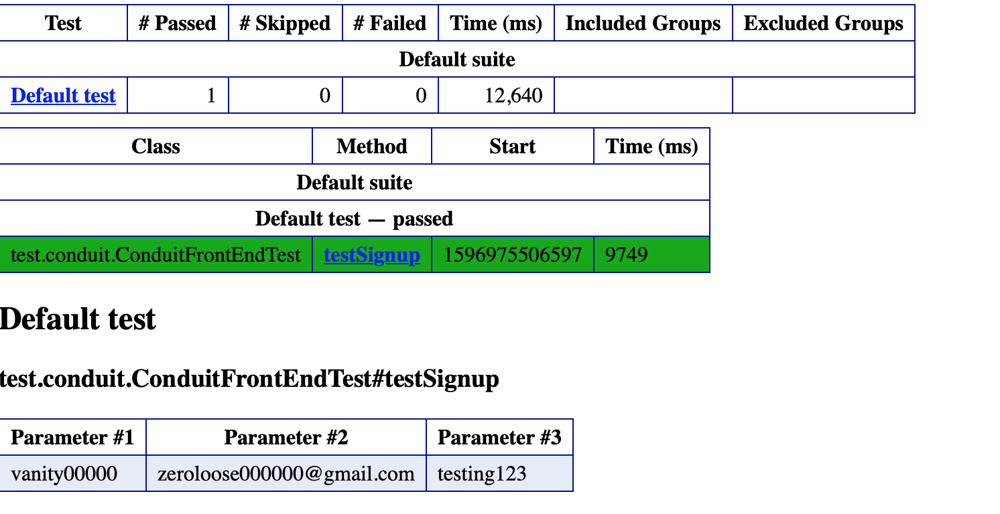
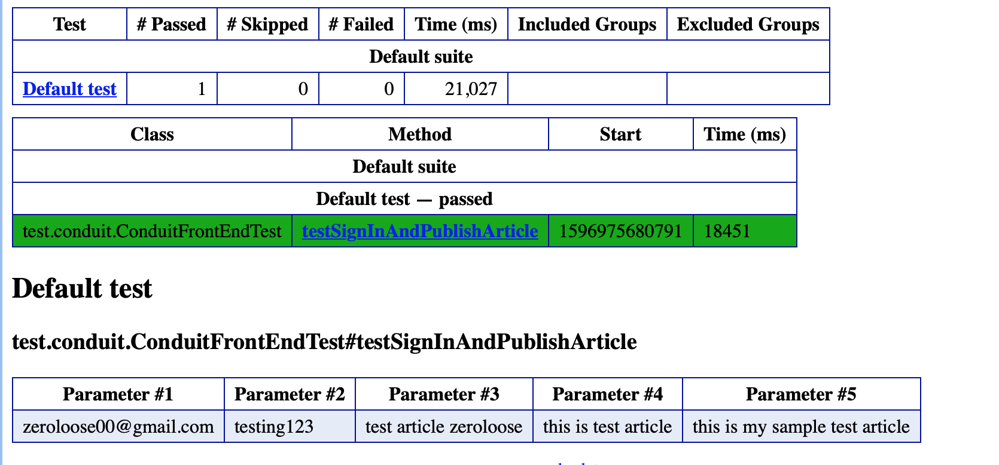
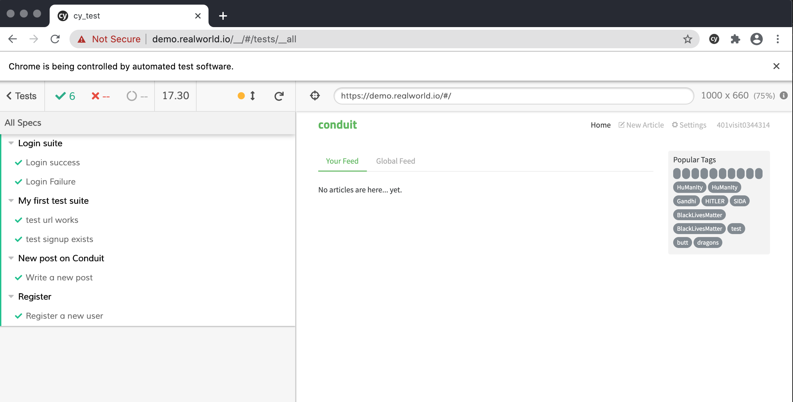
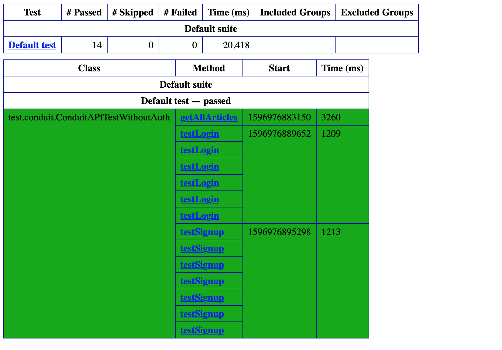
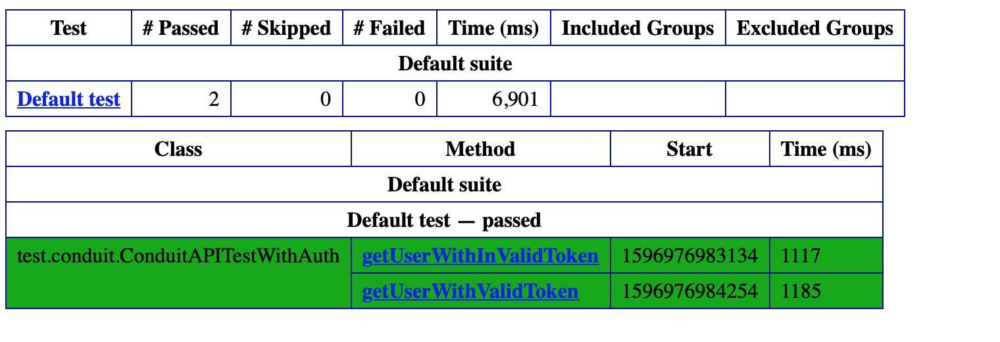

# Test Suite for Conduit app 

This repository contains test scripts for testing Conduit app.
## User interface testing
There are two sets of test suites available for UI testing

1) using Java, selenium, testng and maven (see conduit folder)
  * Key features: 
    * data driven approach in order to keep data separate from functional test logic and to aid with quick scaling
    * page object pattern to avoid tests being too sensitive to UI changes.
2) using Javascript and Cypress (see cy-test folder)

Test cases covered
* Sign up of a new user
* User login
* Navigation to an article
* Creation of a new article

Selenium test run results

Cypress test results

## API testing

API tests are built using Java and Rest Assured. 
Test cases covered
* Auth - token generation
* Get user with valid token
* Get user with invalid token
* User Signup (no auth required)
* User Login (no auth required)
* Get all articles 

Test results

## Suggestions for quality

